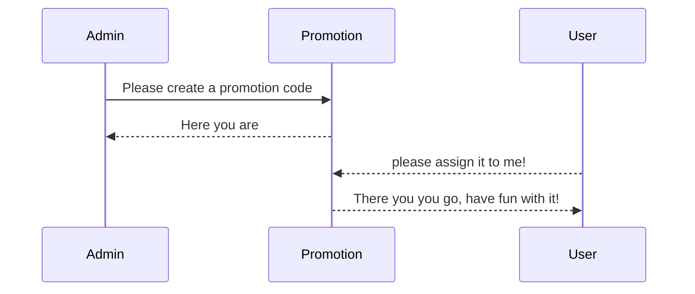

# Welcome to MonoTech Pro!

Hi! Here is my test project which creates **promotion codes** and  make it available for all users.

# How To Use

Clone the repo then just run the test 

There are two types sub modules in the project:

- Users which is responsible for user creation.
	> You can run its test separately by running --filter .

- The second one is promotion part which consists of four routes
	> I thought that Feature test is enough for this kind of functionality but in Future we can add some unit tests.

## UML diagrams

Here Are the possible scenarios:

